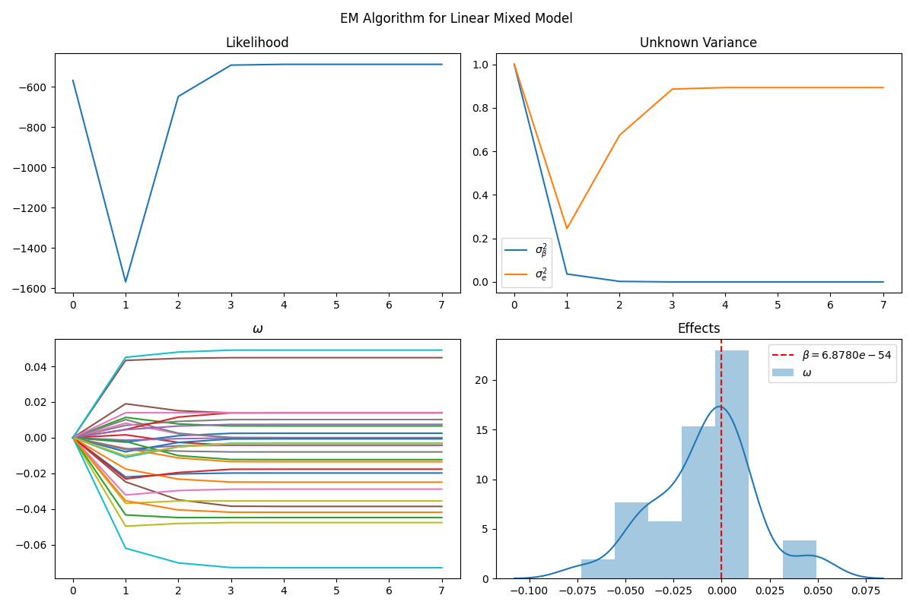

# Expectation-Maximization (EM) algorithm for Linear Mixed-Effect Model (LMM)
- [Expectation-Maximization (EM) algorithm for Linear Mixed-Effect Model (LMM)](#expectation-maximization-em-algorithm-for-linear-mixed-effect-model-lmm)
  - [Model Description](#model-description)
  - [Complete Marginal Data Log-Likelihood](#complete-marginal-data-log-likelihood)
  - [E-Step](#e-step)
  - [M-Step](#m-step)
  - [EM Algorithm](#em-algorithm)
  - [Results](#results)
  - [References](#references)

## Model Description
The linear mixed-effect model (LMM) is a statistical model that accounts for both fixed effects and random effects in a linear regression model. It is used for modeling data where observations are correlated and the correlations are not explained by the covariates. 

Consider a dataset $\{\mathbf{y}, \mathbf{X},\mathbf{Z}\}$ with $n$ samples, where $\mathbf{y} \in \mathbb{R}^n$ is the vector of response variable, $\mathbf{X} \in \mathbb{R}^{n \times p}$ is the matrix of $p$ independent variables, and $\mathbf{Z} \in \mathbb{R}^{n \times c}$ is another matrix of $c$ variables. The linear mixed model builds upon a linear relationship from $\mathbf{y}$ to $\mathbf{X}$ and $\mathbf{Z}$ by
$$\begin{equation}
\mathbf{y} = \mathbf{Z}\mathbf{\omega} + \mathbf{X}\mathbf{\beta} + \mathbf{e},
\end{equation}$$
where $\mathbf{\omega} \in \mathbb{R}^c$ is the vector of fixed effects, $\mathbf{\beta} \in \mathbb{R}^p$ is the vector of random effects with $\mathbf{\beta} \sim \mathcal{N}(0, \sigma^2_\mathbf{\beta} \mathbf{I}_p)$, and $\mathbf{e} \sim \mathcal{N}(0, \sigma^2_e \mathbf{I}_n)$ is the independent noise term. Let $\Theta$ denote the set of unknown parameters $\Theta = \{\mathbf{\omega}, \sigma^2_\mathbf{\beta}, \sigma^2_e\}$.
We can treat $\mathbf{\beta}$ as a latent variable because is it unobserved.

## Complete Marginal Data Log-Likelihood
Let $\Sigma = \sigma_\mathbf{\beta}^2 \mathbf{X}\mathbf{X}^T + \sigma_e^2 \mathbf{I}_n$ be the covariance matrix of $\mathbf{y}$, then the conditional distribution of $\mathbf{y}|\Theta$ is $\mathcal{N}(\mathbf{Z}\mathbf{\omega}, \Sigma)$. The complete data log-likelihood is given by
$$\begin{equation}
\begin{split}
\log p(\mathbf{y}| \Theta) &= -\frac{1}{2} \log |\Sigma| - \frac{1}{2} (\mathbf{y} - \mathbf{Z}\mathbf{\omega})^T \Sigma^{-1} (\mathbf{y} - \mathbf{Z}\mathbf{\omega}) + \text{const} \\
\end{split}\end{equation}.$$

## E-Step
The E-step is to compute the expectation of the complete data log-likelihood with respect to the conditional distribution of $\mathbf{\beta}$ given $\mathbf{y}$ and $\Theta$:
$$\begin{equation}
\begin{split}
Q(\Theta|\Theta^{(t)}) &= \mathbb{E}_{\mathbf{\beta}|\mathbf{y}, \Theta^{(t)}} \left[ \log p(\mathbf{y}, \mathbf{\beta}| \Theta) \right] \\
&= \mathbb{E}_{\mathbf{\beta}|\mathbf{y}, \Theta^{(t)}} \left[ \log p(\mathbf{y}| \mathbf{\beta}, \Theta) + \log p(\mathbf{\beta}| \Theta) \right] \\
&= \mathbb{E}_{\mathbf{\beta}|\mathbf{y}, \Theta^{(t)}} \left[ -\frac{1}{2} \log |\Sigma| - \frac{1}{2} (\mathbf{y} - \mathbf{Z}\mathbf{\omega})^T \Sigma^{-1} (\mathbf{y} - \mathbf{Z}\mathbf{\omega}) + \text{const} \right] \\
&\quad + \mathbb{E}_{\mathbf{\beta}|\mathbf{y}, \Theta^{(t)}} \left[ -\frac{1}{2} \log |\sigma_\mathbf{\beta}^2 \mathbf{I}_p| - \frac{1}{2} \mathbf{\beta}^T (\sigma_\mathbf{\beta}^2 \mathbf{I}_p)^{-1} \mathbf{\beta} + \text{const} \right] \\
&\propto - \mathbb{E}_{\mathbf{\beta}|\mathbf{y}, \Theta^{(t)}} \left[ \mathbf{\beta}^T (\sigma_\mathbf{\beta}^2 \mathbf{I}_p)^{-1} \mathbf{\beta} \right] \\
\end{split}\end{equation}.$$

Thus, the E-step is to compute the following expectations:

$$\begin{equation}
\hat{\beta}= \sigma_\beta^2 \mathbf{X}^T \Sigma^{-1} (\mathbf{y} - \mathbf{Z}\mathbf{\omega})
\end{equation}$$

And $$\begin{equation}
\hat{e}= \mathbf{y} - \mathbf{Z}\mathbf{\omega} - \mathbf{X}\hat{\beta}
\end{equation}$$

## M-Step
The M-step is to maximize the expectation of the complete data log-likelihood with respect to $\Theta$:
$$\begin{equation}
\Theta^{(t+1)} = \arg\max_\Theta Q(\Theta|\Theta^{(t)})
\end{equation}$$
which is equivalent to maximizing (2):
$$\begin{equation}
\begin{split}
&\frac{\partial \ell}{\partial \mathbf{\omega}} = \mathbf{Z}^T \Sigma^{-1} (\mathbf{y} - \mathbf{Z}\mathbf{\omega})=:0\\
\Rightarrow \hat{\mathbf{\omega}} &= (\mathbf{Z}^T \Sigma^{-1} \mathbf{Z})^{-1} \mathbf{Z}^T \Sigma^{-1} \mathbf{y} \\
\end{split}\end{equation}$$

Then, use Method of Moments(MoM) to estimate $\sigma_\beta^2$ and $\sigma_e^2$:
$$\begin{equation}
\begin{split}
\hat{\sigma}_\beta^2 &= \frac{1}{p} \left(\mathbb{E}[\mathbf{\beta}^T\mathbf{\beta}] - \mathbb{E}[\mathbf{\beta}]^2 \right) \\
\hat{\sigma}_e^2 &= \frac{1}{n} \left(\mathbb{E}[\mathbf{e}^T\mathbf{e}] - \mathbb{E}[\mathbf{e}]^2 \right) \\
\end{split}\end{equation}$$

## EM Algorithm
The EM algorithm is an iterative algorithm that alternates between the E-step and the M-step until convergence. The algorithm is summarized as follows:
1. Initialize $\Theta^{(0)}$.
2. For $t = 0, 1, \dots$:
   1. E-step: Estimate $\hat{\mathbf{\beta}}^{(t)}$ and $\hat{\mathbf{e}}^{(t)}$.
   2. M-step: Estimate $\hat{\Theta}^{(t+1)}=\{\hat{\mathbf{\omega}}^{(t+1)}, \hat{\sigma}_\beta^{2(t+1)}, \hat{\sigma}_e^{2(t+1)}\}$.
   3. Check for convergence. If converged, stop. Otherwise, go to step 2.
3. Return result.

## Results
The following results are obtained by running the EM algorithm on the given dataset.

## References
[1]. Lindstrom M J, Bates D M. Newton—Raphson and EM algorithms for linear mixed-effects models for repeated-measures data[J]. Journal of the American Statistical Association, 1988, 83(404): 1014-1022. https://www.jstor.org/stable/2290128

[2]. Laird N M, Ware J H. Random-effects models for longitudinal data[J]. Biometrics, 1982: 963-974. https://www.jstor.org/stable/2529876